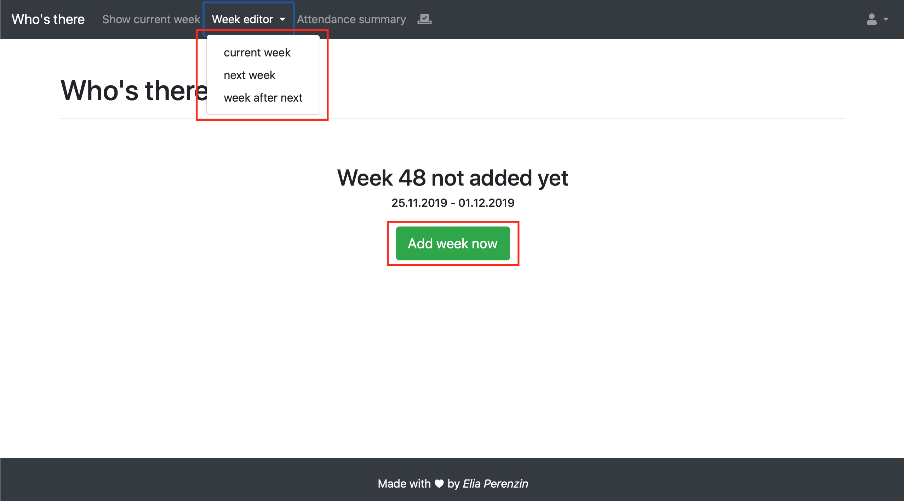
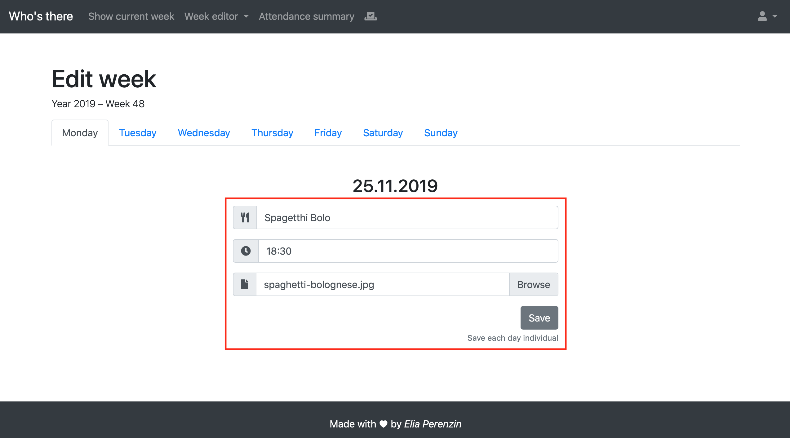
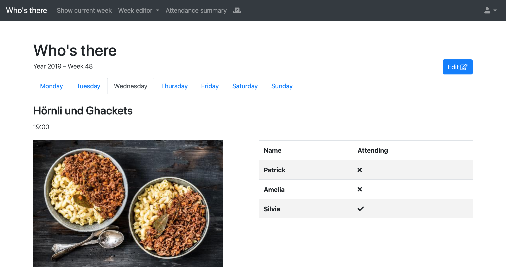
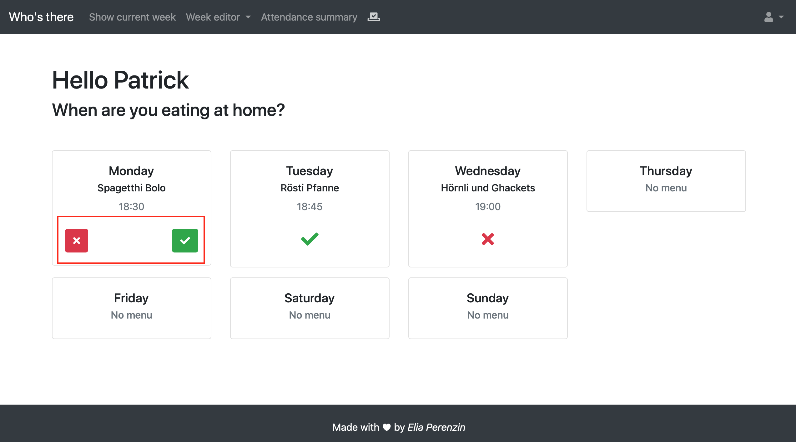
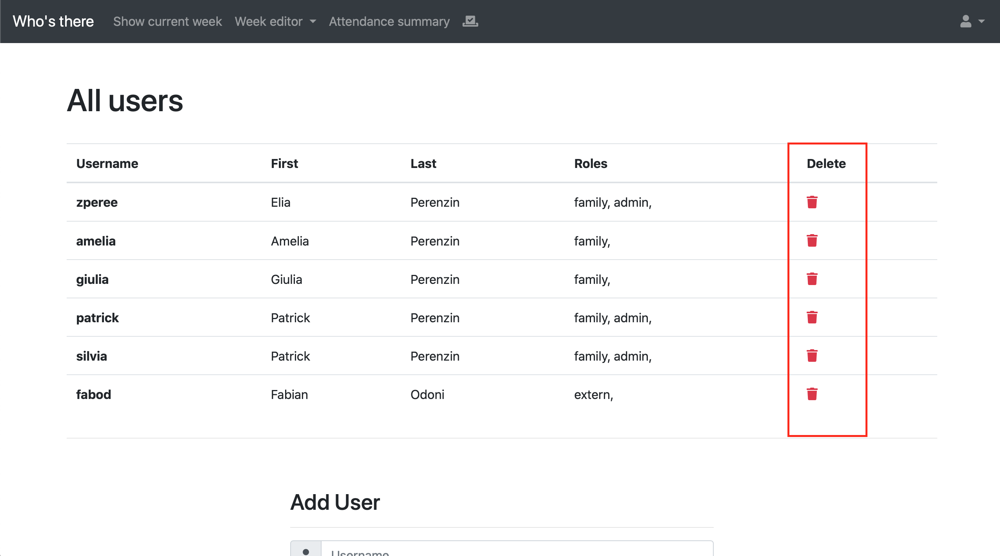
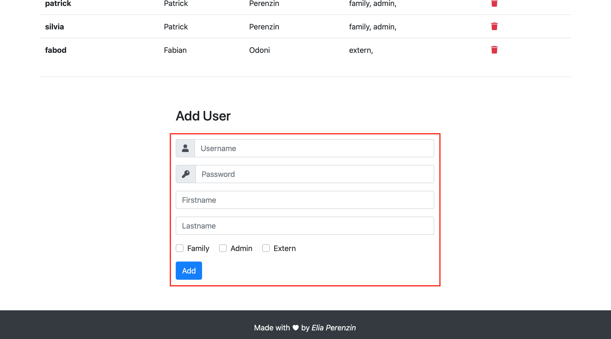
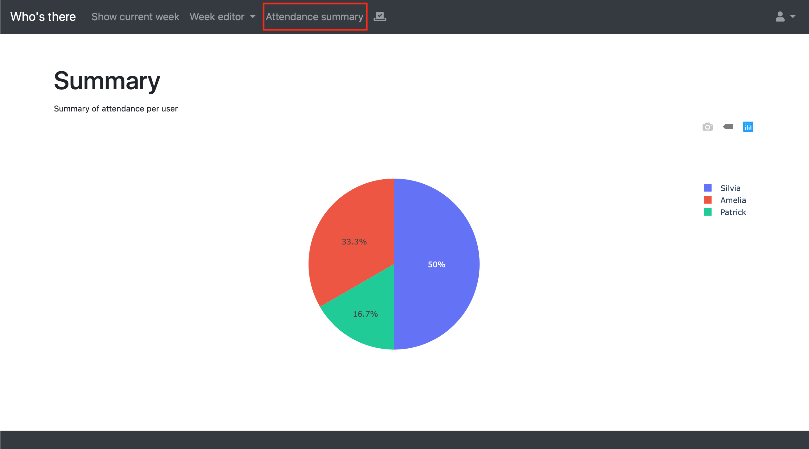

# Who's there
  

## Demo 
Eine kurze Demo des Tools befindet sich auf Youtube unter folgendem Link:
[Demo hier](https://www.youtube.com/watch?v=20hjYxGVrGM&feature=youtu.be)

## Ausgangslage
In einem Haushalt in dem alle zu unregelmässigen Arbeitszeiten arbeiten, ist die koordination am Abend sehr schwierig. 
> *Wer isst heute Abend zuhause?*

Dies ist die wohl meistgestellte Frage im Familienchat und genau dieses Problem soll mit *Who's there* gelöst werden.

## Funktion/Projektidee
Das Tool sollte die Funktionalität besitzen, anzuzeigen wer an welchem Wochentag am Abend zum Nachtessen zuhause sein wird. Zudem sollte es möglich sein das Wochenmenü bereits im Voraus zu definieren, sowie zu definieren wann das Nachtessen bereit sein wird. 
Das Tool sollte über den Browser bedienbar sein.

## Installation
Um Who's there starten zu können muss folgendes mindestens installiert sein:
- `Python 3.6`
- `Flask`
- `Jinja2`
- `Plotly`

Das Tool kann danach über die main.py mit folgendem command ausgeführt werden.

`python main.py`

Das Webtool startet und kann danach von jedem Gerät aus dem Netzwerk über die IP Adresse und Port 5000 aufgerufen werden. 

## Workflow
1. Im Browser wird eine neue Woche erstellt in welcher auch gleich das Wochenmenü definiert werden kann.
2. Die Familienmitglieder geben im Browser ein, an welchen Wochentagen sie zuhause sein werden.
3. Eine Übersicht wird auf einem Bildschirm zuhause angezeigt, sowie kann der aktuelle Stand auch über den Browser aufgerufen werden.

- Alle Einstellungen zum Wochenmenü sollten jederzeit angepasst werden können.

## Mockup
Skizze des Dashboards auf welchem die aktuelle Woche angezeigt wird.

## Workflow
### Dateneingabe
Um eine neue Woche hinzuzufügen wird über das Webinterface die entsprechende Seite aufgerufen. In dem UI kann der Benutzer über eine Eingabemaske jeweils pro Wochentag den Titel der Mahlzeit definieren. Die Eingabe wird in einem File auf dem System gespeichert, sodass es für die Übersicht wieder aufgerufen werden kann.

### Datenverarbeitung/Speicherung
Alle Daten werden als json in `.txt` Dateien im Ordner `data/` gespeichert. Dabei wird zwischen zwei Arten von Daten unterschieden. Es gibt die `week_data/` und die `users.txt`

##### Week data
Im Ordner `week_data/` wird pro Woche die eingetragen wird ein neues File angelegt. Dieses File enthält danach folgende Informationen:

- Wochentage und ihr Datum
- Menu pro Wochentag
- Alle Personen die bereits zu- oder abgesagt haben

##### users.txt
Im File `users.txt` werden die Informationen für das Login gespeichert. Das File beinhaltet ein Dictionary mit allen Usernamen, Passwörter und deren Berechtigungen.

### Datenausgabe
1. Zuerst wird überprüft ob valide Parameter in der URL übergeben worden sind. Zum Beispiel `/2019/42` für die 42. Woche im Jahr 2019.
2. Falls keine gültigen Parameter eingegeben wurden, wird die aktuelle Kalenderwoche ermittelt und auf diese Seite redirected.
3. Als nächstes wird überprüft ob bereits ein Wochenplan für diese Woche erstellt worden ist. 
4. Falls dies nicht der Fall ist wird eine leere Woche erstellt.
5. Zum Schluss wird die Seite mit den entsprechenden Daten geladen.

## Benutzeranleitung
### Woche erfassen
Wenn man nach der Installation das erste mal auf die Seite geht, sind noch keine Daten vorhanden. Es gibt zwei möglichkeiten eine Woche anzulegen. 

1. Die erste Möglichkeit besteht darin über die Grüne Schaltfläche die aktuelle Woche hinzuzufügen oder über den Menüpunkt `Week editor` die aktuelle, die nächste oder die übernächste Woche hinzuzufügen. 

2. Danach befindet man sich im `Weekeditor` und kann alle Tage in der ausgewählten Woche bearbeiten. Es besteht die möglichkeit das Menü zu definieren, so wie eine zeit festzulegen und ein Bild hochzuladen.

3. Nach der Eingabe kann man den Tag speichern. **Wichtig jeder Tag mus einzeln gespeichert werden**

4. Das File wird nach dem speichern erstellt und kann über `show current week` angezeigt werden.

### Abstimmen
Damit ersichtlich wird welche Personen an welchem Tag zuhause sind kann jede Person individuell Abstimmen wann er zuhause sein wird.

1. Im Menü auf folgendes Icon klicken:

2. Danach muss der Benutzer sich einloggen. Für die Demo wurde für den Dozenten @fabod bereits einen User erstellt: Username: **fabod**
Password: **1234** 
3. Nach dem einloggen kann für jeden Tag in dem bereits ein Menü definiert wurde abgestimmt werden ob man dann zuhause ist.

4. Bei erneutem klicken auf das Icon kann die Auswahl geändert werden.
### Userverwaltung
1. Um alle Login bzw. Benutzer zu Verwalten muss ein User eingeloggt sein. Danach kann er oben rechts auf sein Profil klicken und den Menüpunkt `Manage users` auswählen. 

2. Auf der Benutzeroberfläche werden oben alle vorhandenen Benutzer aufgelistet. Diese könne auch gelöscht werden mit dem Icon ganz auf der rechten Seite. 

3. Neue Benutzer können über das Formular ganz unten hinzugefügt werden. Dabei muss ein Benutzername sowie ein Password definiert werden. Die Rollen die aus der Liste ausgewählt werden können haben zurzeit noch keinen Einfluss auf das Verhalten des Benutzers und dient nur der einfacheren unterscheidung. 

### Auswertung
Im Menupünkt `Attendance summary` kann eine Auswertung gemacht werden, wie oft eine Person zum Nachtessen zuhause war. 
